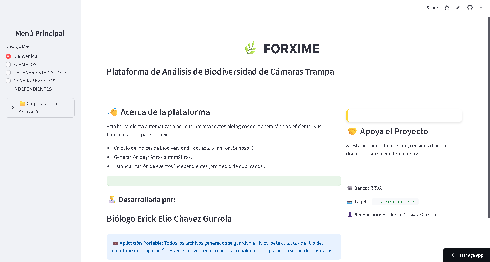
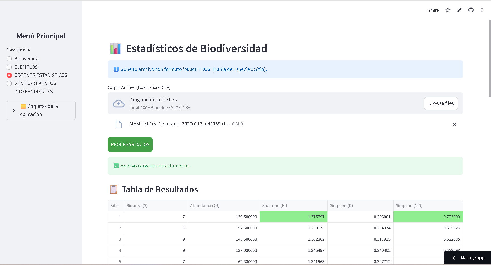

# 🌿 FORXIME

<div align="center">


**Plataforma de Análisis de Biodiversidad de Cámaras Trampa**

*Herramienta automatizada para procesar datos biológicos de manera rápida y eficiente*

[🚀 Inicio Rápido](#-inicio-rápido) • [📖 Documentación](#-documentación) • [💼 Portable](#-características-portables) • [🤝 Contribuir](#-contribuir)

</div>

---

## 📋 Descripción

FORXIME es una aplicación **100% portable** desarrollada por el **Biólogo Erick Elio Chavez Gurrola** para el análisis de datos de biodiversidad obtenidos mediante cámaras trampa. La plataforma permite calcular índices de biodiversidad, generar gráficas automáticas y procesar eventos independientes de manera eficiente.

### ✨ Características Principales

- 🔢 **Cálculo de Índices de Biodiversidad**
  - Riqueza de especies (S)
  - Abundancia total (N)
  - Índice de Shannon-Wiener (H')
  - Índice de Simpson (D y 1-D)

- 📊 **Visualización Automática**
  - Gráficas de riqueza por sitio
  - Gráficas de diversidad (Shannon)
  - Gráficas de abundancia
  - Exportación en alta calidad (300 DPI)

- 🔄 **Procesamiento de Eventos**
  - Detección automática de duplicados
  - Cálculo de promedios
  - Generación de matrices especie × sitio

- 💼 **100% Portable**
  - Todo en una sola carpeta
  - Sin instalación del sistema
  - Fácil de mover y compartir
  - Múltiples instancias independientes

## 🚀 Inicio Rápido

### Requisitos Previos

- Python 3.7 o superior
- pip (gestor de paquetes de Python)

### Instalación

1. **Clona el repositorio**

   ```bash
   git clone https://github.com/Biochavezforester/FOR-XIME.git
   cd forxime
   ```

2. **Instala las dependencias**

   ```bash
   pip install -r requirements.txt
   ```

3. **Genera los archivos de ejemplo** (opcional)

   ```bash
   python create_examples.py
   ```

4. **Ejecuta la aplicación**

   ```bash
   streamlit run app.py
   ```

5. **Abre tu navegador** en `http://localhost:8501`

## 📖 Documentación

### Estructura del Proyecto

```
forxime/
├── 📄 app.py                    # Aplicación principal de Streamlit
├── 📄 requirements.txt          # Dependencias de Python
├── 📄 create_examples.py        # Generador de archivos de ejemplo
├── 📄 README.md                 # Este archivo
├── 📄 PORTABLE.md               # Guía de portabilidad
├── 📄 LICENSE                   # Licencia MIT
├── 📄 .gitignore                # Archivos ignorados por Git
│
├── 📁 examples/                 # Archivos de ejemplo
│   ├── ejemplo_mamiferos.xlsx   # Formato para estadísticos
│   └── ejemplo_eventos.xlsx     # Formato para eventos
│
├── 📁 outputs/                  # ⭐ Resultados generados
│   ├── *.xlsx                   # Tablas de resultados
│   └── *.png                    # Gráficas (300 DPI)
│
└── 📁 temp/                     # Archivos temporales
```

### Uso Básico

#### 1. Ver Ejemplos

- Navega a la sección **EJEMPLOS**
- Descarga los archivos de muestra
- Revisa el formato requerido

#### 2. Análisis Estadístico

- Ve a **OBTENER ESTADISTICOS**
- Sube tu archivo Excel/CSV con formato especie × sitio
- Haz clic en **PROCESAR DATOS**
- Descarga resultados y gráficas

#### 3. Procesar Eventos

- Ve a **GENERAR EVENTOS INDEPENDIENTES**
- Sube tu base de datos cruda
- Haz clic en **PROCESAR Y PROMEDIAR**
- Descarga la matriz generada

### Formatos de Datos

#### Formato MAMIFEROS (Para Estadísticos)

| Especie | Sitio_1 | Sitio_2 | Sitio_3 | EVENTO INDEPENDIENTE |
|---------|---------|---------|---------|----------------------|
| Jaguar  | 5       | 3       | 7       | 15                   |
| Puma    | 3       | 4       | 2       | 9                    |
| Ocelote | 8       | 6       | 5       | 19                   |

#### Formato EVENTOS (Para Procesar)

| sitio | especie | eventos_independientes |
|-------|---------|------------------------|
| 1     | JAGUAR  | 5                      |
| 1     | PUMA    | 3                      |
| 2     | JAGUAR  | 7                      |

## 💼 Características Portables

FORXIME es una aplicación **completamente portable**:

- ✅ **Sin instalación**: No modifica el registro ni carpetas del sistema
- ✅ **Auto-contenida**: Todos los archivos en una carpeta
- ✅ **Fácil de mover**: Copia la carpeta completa a USB, red, etc.
- ✅ **Múltiples copias**: Diferentes proyectos en carpetas separadas
- ✅ **Backup simple**: Copia la carpeta = backup completo

### Archivos con Timestamp

Todos los archivos generados incluyen fecha y hora:

- `FORXIME_Estadisticos_20260111_203045.xlsx`
- `Grafica_Riqueza_20260111_203045.png`
- `MAMIFEROS_Generado_20260111_205130.xlsx`

Esto evita sobrescribir resultados anteriores.

📖 **Más información**: Ver [PORTABLE.md](PORTABLE.md)

## 🛠️ Tecnologías

- **[Streamlit](https://streamlit.io/)** - Framework de aplicaciones web
- **[Pandas](https://pandas.pydata.org/)** - Análisis de datos
- **[NumPy](https://numpy.org/)** - Cálculos numéricos
- **[Matplotlib](https://matplotlib.org/)** - Visualización de datos
- **[OpenPyXL](https://openpyxl.readthedocs.io/)** - Manejo de archivos Excel

## 📊 Capturas de Pantalla

### Página de Bienvenida



### Sección de Ejemplos


### Resultados Estadísticos



## 🤝 Contribuir

Las contribuciones son bienvenidas. Por favor:

1. Fork el proyecto
2. Crea una rama para tu feature (`git checkout -b feature/AmazingFeature`)
3. Commit tus cambios (`git commit -m 'Add some AmazingFeature'`)
4. Push a la rama (`git push origin feature/AmazingFeature`)
5. Abre un Pull Request

## 📝 Licencia

Este proyecto está bajo la Licencia MIT. Ver el archivo [LICENSE](LICENSE) para más detalles.

## 👨‍🔬 Autor

**Biólogo Erick Elio Chavez Gurrola**

## 💰 Apoyo al Proyecto

Si esta herramienta te es útil, considera hacer un donativo:

- 🏦 **Banco**: BBVA
- 💳 **Tarjeta**: 4152 3144 0105 9541
- 👤 **Beneficiario**: Erick Elio Chavez Gurrola

## 📞 Contacto

Para preguntas, sugerencias o reportar problemas:

- Abre un [Issue](https://github.com/Biochavezforester/FOR-XIME/issues)
- Contacta al desarrollador

## 🙏 Agradecimientos

- A la comunidad de conservación de biodiversidad
- A los usuarios que proporcionan retroalimentación
- A los desarrolladores de las bibliotecas utilizadas

---

<div align="center">

**Desarrollado con 💚 para la conservación de la biodiversidad**

⭐ Si te gusta este proyecto, dale una estrella en GitHub

</div>
